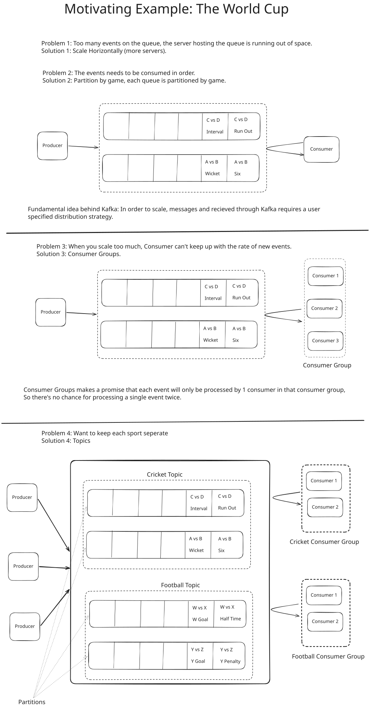
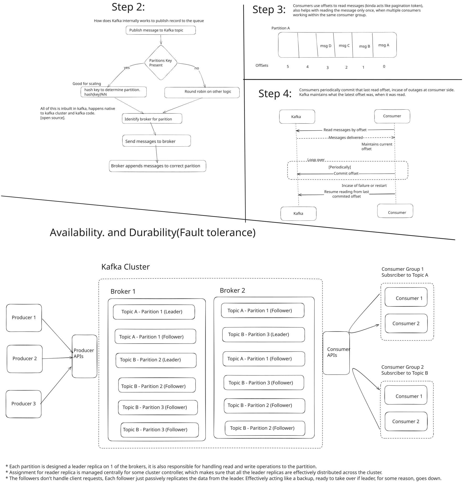

[Reference youtube video](https://www.youtube.com/watch?v=DU8o-OTeoCc)

### Kafka System Design Deep Dive w/ a Ex-Meta Staff Engineer
https://www.hellointerview.com/learn/system-design/deep-dives/kafka

---------

Kafka is a event streaming platform. 
Can be used as a message queue or s stream processing system.

It used by 80% of fortune 100. 
according to hello interview: 1 of the top 5 technologies to ace.

Sections:
1. Motivating example.
2. Overview
3. When to use it in interview.
4. What you should know for deep dives.

-----------

### Section 1: Motivating Example: The World cup.


reference: motivating-example.excalidraw [https://excalidraw.com/]

----------------------

### Section 2: Kafka Overview.

#### Terminology:
* Broker: The servers (physical/virtual) that holds the "queue". Servers where the Kafka cluster is hosted.
* Partitions: The "queue". Ordered, Immutable sequence of messages that we append to, like a log file. 
* * Each broker can have multiple partitions.
* Topic: A logical grouping of partitions. You publish to and consume from topics in Kafka.
* Producers: Write messages/records to topics.
* Consumer: Read messages/records off of topics.

Note: Partitions are for horizontal scaling, while topics are for logical separation of concerns, just a way to organize the data. 

#### Look under the hood: 
Lifecycle of the message for a Kafka message.

Step 1: Producer creates and publishes a record/message.

Message Structure:
key, value, timestamp, headers

Add a record via CLI
```
kafka-console-producer --broker-list localhost:8080 --topic my_topic --proporty "parse.key=true"
key1: Hello, kafka with key
key2: another message with different key
```

Add a record via kafka-js:
```
    const kafka = new Kafka({
        clientId: "my_app",
        brokers: ["localhost:8080"]
    )}
    const producer - kafka.producer()
    
    const run = async () => {
        await producer.connect()
        
        await producer.send({
            topic: "my_topic",
            messages: [
                {key: "key1", value: "Hello, kafka with key"},
                {key: "key2", value: "Another message with different key"}
            ],
        })
    }
```

Step 2: Kafka assigns message to correct broker, topic and partition.
* All of this is inbuilt in kafka, happens native to kafka cluster and kafka code, all open source.

Step 3: 
Consumers consume messages using offset (kinda like a pagination token)

Step 4:
Periodically, consumers commit the offset of Kafka, to handle any outages on consumer side.

Step 5:
Consume a record using CLI
```
kafka-console-consumer --bootstrap-server localhost:8080 --topic my_topic --from-beginning"
```
#Output
key1: Hello, kafka with key
key2: another message with different key

Consume a record via kafka-js
```
const consumer = kafka.consumer({groupId: "my-group"})
const run = async () => {
    await consumer.connect()
    
    await consumer.subscribe({topic: "my_topic"})
    
    await consumer.run({
        eachMessage: async({topic, parition, message}) => {
            log({
                key: message.key.toString()
                value: message.key.toString()
            })
        }
    })
}
```


reference: kafka-overview.excalidraw [https://excalidraw.com/]

--------------------------------------------------------------------------

### Section 3: When to Use Kafka in an interview?

Usecase 1:
Anytime you need a message queue. Processing can be done async.

Eg 1: youtube transcoding.
`client -> upload server -> Store full video (S3) -> Kafka <- transcoders -> Writes transcoded video back to S3.`

Eg 2: In-Order message processing i.e. TicketMaster waiting queue.
For events with high customer demand, where a virtual queue is needed.
`client -> event service -> kafka (waiting queue) <- event service -> eventDB`

Eg 3: Decouple producer and consumer so they can scale independently i.e. Leetcode or online judge.
primary server can be scaled based on traffic, the runtime servers might be costly, now to be cost efficient,
we can queue up the events and process 1 by 1, it can have some delays.
```
Client(leetcode submission) -> primary server <-> DB
                                    |
                                    --> kafka <- worker <--> (java/python/js runtime)
```

Usecase 2: 
Anytime you need a stream. Need to process a lot of time in real time.

Eg 1: Ad click aggregator. (TODO: deep dive on this, present on hellointerview website)
When a lot of data needs to be processed in realtime. Kind of opposite of queue, where a lot of events can be kept and processed whenever possible.
When user clicks an ad, aggregate the data and tell the advertiser how many times there ad has been clicked.
`client -> producer <- Kafka (Ad click Stream) <- Flink -> DB`

Eg 2: Stream of messages need to tbe processed by multiple consumer simultaneously.
Messenger or FB live comments (Pubsub model).
```
Client (people watching live video) -> comment management service <-> DB
                                        |
                                        --> kafka <- realtime messaging service
                                                        | 
Client(people watching live video) <---------------------
```

--------------------------------------------------------------------------

### Section 3: What you should know about Kafka for deep dives in interviews.

First documenting high level design. and using that high level design in order to expand upon it,
to talk in depth about a few key areas, where you show off that technical depth.

1. Scalability.
2. Fault tolerance & durability.
3. Errors and Retries
4. Performance optimizations
5. Retention policies

#### Scalability.

There is no limit on the message size in kafka, other than the natural hardware limits.
Aim for <1MB per message. Only keep the message identifiers on the kafka record, not the complete blob.

One good Broker up to 1 TB data & 10k messages per second. (can take it at base level, for back of the envelope estimations)

In case the system can't work with this single broker. how to scale?
* More brokers.
* * more disk space, good sharding mechanism.
* Choose a good partition key. 
* * a bad key can cause hot partition issues, all data ends up on a single partition.
* * a good key evenly distributes the data across all brokers

How to handle a hot partition?
1. Remove the key :P, managed kafka services, confluent cloud, AWS MSK (managed streaming via kafka).
2. Compound key - AdId:1-10 or AdId:UserId (Eg of AddClickAggregator).
* * Producer needs to know when to append number (using bloom filters), incase hot partitioning happened, No ordering maintained when appending a random number.
3. Backpressure - slow down the producer.
* * Didn't really find it useful.

TODO: Read about bloom filters.

#### Fault tolerance and durability.

Diagram mentioned above in `kafka-overview.svg`

Relevant settings:
- acks (acksall - maximum durability) - how many followers need to acknowledge the replication - durability vs performance.
- replication factor (3 is default)

What if Kafka goes down?
Push back, not a very good question, Kafka doesn't go down. 
Durability and fault tolerance is very high, because of replication.

What happens when a consumer goes down?
1. Just read the latest offset.
* * Consumer commits the offsets periodically to Kafka cluster.
* * A new consumer can start reading from that last offset present in cluster.
* * when to commit the offset to kafka is also important, need to be sure that the operations are completed for a particular record, only after that, commit.
2. If a consumer group, rebalance.
* * When working with multiple consumers, each consumer is assigned a set of partitions.
* * when one consumer goes down, the remaining consumers needs to rebalance to divide the partitions among them.

#### Errors and Retries
Kafka itself handles most of the reliability.
Producer retries:
```
const producer = kafka.producer({
    retry: {
        retries: 5,
        initialRetryTime: 100 // or maybe exponential backoff and jitter.
    },
    idempotent: true
})
```

Consumer retries:
```
Main Topic <- Consumer -> Retry Topic <- Consumer -> DLQ Topic.
              (after N failures)         (after final failure)      
```
AWS SQS does it out of the box. Kafka doesn't, need to manually configure retry and DLQ topics.

#### Performance optimizations
When using Kafka as a stream to process realtime data. 

Batch messages in producer:
```
const producer = kafka.producer({
    batch: {
        maxSize: 16384, // maximum batch size in bytes.
        maTime: 100, // maximum time to wait before sending a batch
    }
});
```

Compress messages in producer:
```
const producer = kafa.producer({
    compression: CompressionTypes.GZIP, // present in kafkajs library
})
```

#### Retention policies

Two settings:
1. retention.ms (default 7 days) - how long to keep the messages.
2. retention.bytes (default 1 GB) - when to start purging based on size.

----------------------------


