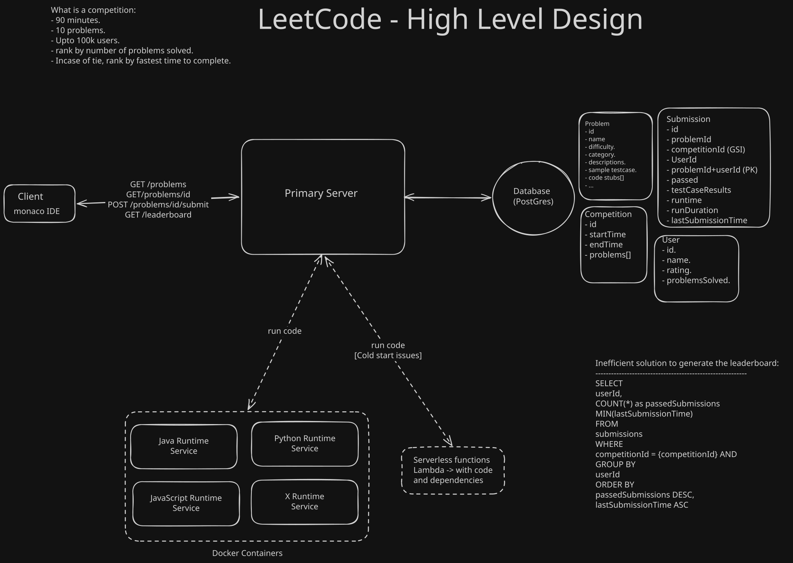
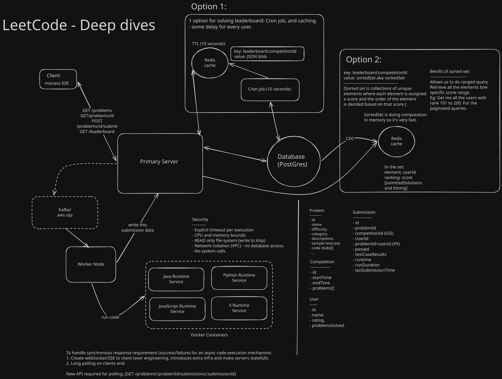

[Reference youtube video](https://www.youtube.com/watch?v=1xHADtekTNg)

### System Design Interview: Design Ticketmaster w/ a Ex-Meta Staff Engineer
https://www.hellointerview.com/learn/system-design/problem-breakdowns/leetcode

------------------------------------------------------------------------------------------

### Question:  
LeetCode is a platform that helps software engineers prepare for coding interviews. It offers
a vast collection pf coding problems, ranging from easy to hard, and providers a platform for
users to answer questions and get feedback on their solutions.
They also run periodic coding competitions.

Also called:
* Online Judge.
* Online Coding competition
* Live leaderboard.

Roadmap for any system design interview:  
1. Requirements - Functional and Non-Functional.
2. Core Entities
3. API or Interface
4. Data flow
5. High level design
6. Deep dives

Deciding on NFRs:
Qualities of the system.
- CAP Theorem (or PACELC theorem)
- Scalability
- Security
- Compliance
- Fault tolerance

-----------------------------------------------

**Functional Requirements:**  
- View a list of problems.
- View a given problem and code a solution.
- Submit answer & get feedback.
- Support competition with live leaderboard.

**Non-Functional Requirements:**  
- availability >> consistency [Every single read doesn't need latest writes, some delay is OK]
- security & isolation when running users code.
- scale to support competitions with 100k users.
- fresh/nest realtime leaderboard.

I'll skip the back of the envelope estimations for now, I'll do them later 
when I need to make some decisions in my design and need this information.

**Scale of the system:**  
- 100k daily active users (DAU).
- 5M total accounts.
- 3k problems.
- 100k peak for competitions.

**Out of Scope:**  
N/A

-------------------------------------------------

Model only the parts that you know about. Don't try to come up with the complete
Data model and entities yet.

**Core Entities:** (5 minutes)   
- User.
- Problem.
- TestCases.
- Submission.
- Competitions.
- Leaderboard.

-------------------------------------------------

**APIs:** (10 minutes)  
// View a list of problems:
GET `/problems?category={}&difficulty=()&page={}&size={}` -> Partial<Problem>[]

// View a problem:
GET `/problems/:problemId` -> Problem

// Submit a solution:
POST `/problems/:problemId/submit` -> Submission
{
    code, <or s3 url>
    language,
    competitionId?
}

// get leaderboard
GET `/leaderboard/:competitionId?page={}&size{}` -> Leaderboard

// Long poll for submission status
GET `/problems/:problemId/submissions/:submissionId` -> Success/Failure
Needed after making the code execution piece asynchronous.

--------------------------------------------------

**High Level Design:** (20 minutes)  

reference: hld-without-deep-dive.excalidraw [https://excalidraw.com/]

* This covers all the functional requirements.
* The next step in the deep dive section is going to be about the non-functional requirements.
* While coming up with this basic design, consistently remind the interviewer that you're taking some shortcuts and will come back to these.

--------------------------------------------------

**Deep dive:** (15 minutes)  

Based on chat with Gemini on how this code execution works:

The Execution Pipeline (The Flow)
* The UI (Monaco): The browser editor simply packages the user's code into a JSON string payload (e.g., {"lang": "python", "code": "..."}).
* The API Server: Receives the payload, saves a "Pending" record to the database, and immediately drops the payload onto a Message Queue. It does not run the code.
* The Message Queue: Buffers the requests to protect the system from massive spikes (e.g., end-of-competition submissions).
* The Worker Node: Pulls the message from the queue, pulls the appropriate language runtime image, and spawns a temporary Docker container to execute the string.

What goes on worker server:
* The Execution Daemon & The "Warm Pool"
* * You do not let Docker manage its own lifecycle. You write a custom background process (the Daemon), usually in Go or Rust, that runs directly on the Worker Node.
* * Pre-Booting: When the Worker Node boots up, the Daemon immediately spins up a pool of "Warm" containers—for example, 50 Python, 50 Java, and 50 C++ containers.
* * The State Machine: The Daemon maintains an in-memory queue. It tracks exactly which containers are IDLE, BUSY, or DEAD.
* * The Route: When the primary server drops a Python submission onto the queue, the Daemon pops an IDLE Python container from its internal list and assigns the task. Zero boot time.
* Passing the Code (The Internal API)
* * You cannot bake the user's code into the Docker image, and writing the code to the host's disk just to map it into the container is a slow I/O bottleneck.
* * The Setup: The base Docker image for the language (e.g., Python) contain the Python interpreter. It contains a tiny, ultra-fast HTTP server (often a custom Go binary or FastCGI).
* * The Execution: The Daemon sends the user's string payload via a local HTTP request (or an in-memory Unix Domain Socket) directly to localhost:8080 inside the specific warm container.
* * The Response: The internal HTTP server evaluates the code, captures STDOUT/STDERR, and returns the JSON payload back to the Daemon.
* File I/O: Mounts and tmpfs
* * LeetCode problems have massive test cases (sometimes megabytes of arrays or strings). You cannot pass 5MB of test cases via HTTP for every single submission.
* * Test Case Caching (Bind Mounts): The Worker Node downloads the test cases for Problem #123 from S3 exactly once and saves them to its local SSD. When the Daemon assigns a submission to a container, it creates a read-only bind mount (-v /host/cache/prob_123:/tests:ro). The container reads the test cases as if they were local files, but they are physically stored on the fast host drive.
* * User Output (tmpfs): If the user's algorithm requires writing temporary files, you absolutely do not write them to the host's physical disk. You mount a tmpfs volume (--tmpfs /scratch). This is a RAM-disk. It acts like a file system but lives entirely in memory, making it incredibly fast and guaranteeing it vanishes when the container dies.
* The Golden Rule: The "One-and-Done" Lifecycle
* * Here is the ultimate Staff-level bullshit check: Never reuse a container.
* * If User A runs a Python script, they could easily write code that alters global variables, leaves background threads running, or maliciously corrupts the environment. If you reuse that same container for User B, User B might fail the test cases because of User A's leftover state.
* The Workflow:
* * Daemon sends code to Warm Container #4.
* * Container #4 returns the result.
* * Daemon immediately issues a SIGKILL to entirely destroy Container #4.
* * The Daemon asynchronously spins up a brand new Container #55 to replenish the warm pool.

The Teardown
* Once the execution finishes (Success, Timeout, or OOM), the Worker Node captures the STDOUT/STDERR logs, updates the primary database with the final result, and completely destroys the container to ensure a pristine environment for the next run.

The Staff-Level Security Constraints (The Sandbox) [Some of these are provided by docker].
* If you run a standard Docker container, malicious code can still destroy the host node. You must lock it down using these 5 Linux kernel features:
* Resource Bounds (cgroups): Limit memory (e.g., --memory=256m) and CPU allocation. If a user submits a "Fork Bomb" or an intentional memory leak, the kernel instantly OOMKills the container without crashing the underlying worker node.
* Wall-Clock Timeouts: Enforce a strict execution limit (e.g., 5 seconds) at the worker level. If a user submits an infinite while(True) loop, the worker issues a SIGKILL to destroy the container and free up resources.
* Network Isolation (Namespaces): Run with --network=none. The container has no network stack. It cannot mine cryptocurrency, launch DDoS attacks, or attempt to query your internal databases.
* Read-Only File System: Mount the root file system as read-only. Provide a small, temporary, in-memory mount (like tmpfs at /tmp) if the algorithm requires scratch space. This prevents rm -rf / attacks.
* System Call Restrictions (Seccomp): Apply strict security profiles that block the container from making dangerous calls to the Linux kernel (e.g., preventing it from launching unauthorized child processes).

reference: hld-with-deep-dive.excalidraw [https://excalidraw.com/]

--------------------------------------------------

