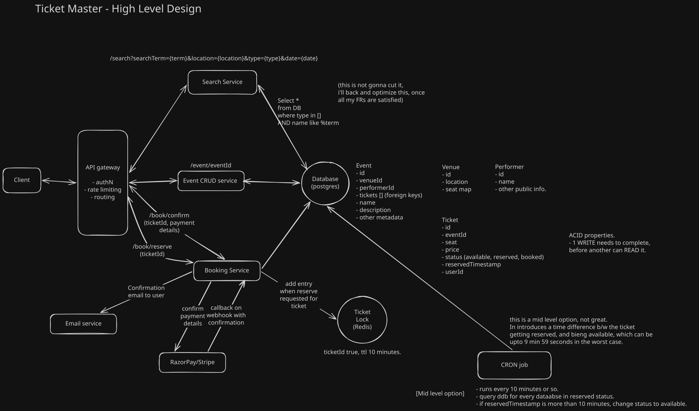
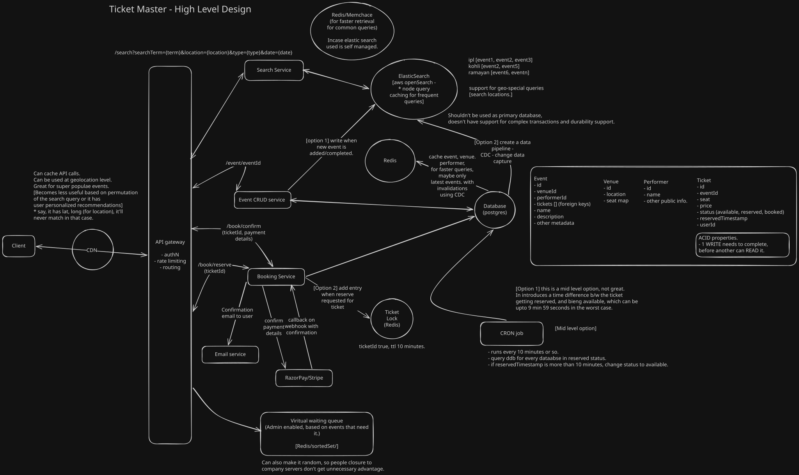

[Reference youtube video](https://www.youtube.com/watch?v=fhdPyoO6aXI&t=1s)

### System Design Interview: Design Ticketmaster w/ a Ex-Meta Staff Engineer
https://www.hellointerview.com/learn/system-design/problem-breakdowns/ticketmaster

Question:  
Ticketmaster is an online platform that allows uses to purchase tickets for concerts, sports events, theater, and other live entertainment, has ~100M DAU.

Roadmap for any system design interview:  
1. Requirements - Functional and Non functional.
2. Core Entities
3. API
4. High level design
5. Deep dives

-----------------------------------------------
-----------------------------------------------

**Functional Requirements:**
* Book tickets. 
* View an event. 
* Search for events.

**Non-Functional Requirements:**  
when working with scale and distributed systems, always work backwords from CAP theorem (2 of 3 possible)(Consistency, Availability, Partition Tolerance)
* Consistency > Availability (For Booking)(no double booking) [done]
* Availability > Consistency (for Search and view) [done]
* Read >> Write (100 to 1) [done]
* Scalability to handle surges from popular events. [done]

**Out of Scope:**  
* GDPR compliance.
* Fault tolerance.
* Sending notifications
* etc.

-----------------------------------------------

**Core Entities:** (5 minutes)   
Purpose of core entities is get understanding of data to persist in system and to be used by APIs.

(exact fields for these entities will be defined as we move into the design further)
- Event (name, description)
- Venue (name, address)
- Performer
- Ticket

------------------------------------------------

**APIs:** (10 minutes)  

- GET `/event/eventId` -> [Event, Venue, Performer, Ticket]
- GET `/search?searchTerm={term}&location={location}&type={type}&date={date}` -> [<PartialEvent>()] (not complete information)

- POST `/book/reserve`
header: JWT | sessionToken (userId)
body {
 ticketId
}

- POST `/book/confirm`
header: JWT | sessionToken (userId)
body {
 ticketId 
 paymentDetails (razorPay)
}

------------------------------------------------

**High Level Design:** (20 minutes)  

microservices are a good default to go to.
while building HLD, go 1 by 1 with the APIs.

Options for HLD:
* Using eraser.io (logged in through abhinandan1812@gmail.com) (3 diagram limit)
* Using excalidraw.com (without login) (save files locally)

reference: hld-without-deep-dive.excalidraw [https://excalidraw.com/]

During the diagram - 
* Show that there are decent relationships b/w different entities. using foreign keys.
* Going with Postgres, a SQL database, with justification that I use it frequently.
* * also need ACID properties on tickets. [Atomicity, Consistency, Isolation, and Durability]
* * gives flexibility to do transactions.
* 

SQL vs NoSQL is not that interesting anymore. it's about the quality of database that you use.
Everything things can be done by a bunch of DBs, which can be both SQL and NoSQL.
Eg: ACID on DDB is possible. 

TODO: Need to do a quick deep dive on what different kind of usecases can be done by which databases.

Start with happy scenario.
Mention things that can be done, mentioning, you're keeping it out of scope, like sending confirmation email in this case.

Move on edge case scenarios. Say, user reserved the ticket, not booked it, need to get the ticket out of reserved state after 10 minutes.
For this edgecase. 

Option 1: (works, bad solution) 
* Introduce a field reservedTimestamp in the Ticket DB.
* Update the search query to also account for tickets which have reservedTimestamp more than 10 minutes and are not booked.
* Makes GET eventId API slower.

Option 2: (works, good not great)
* Introduce a cron job that runs every 10 minutes.
* Checks Tickets DB, updates the status to available for all the tickets which have reserved timestamp more than 10 minutes.
* Introduces a delay more than 10 minutes for a ticket to become available again.

Option 3 (works, great solution)
* Create a ticket lock - Redis.
* When reserve query comes, add a entry with ticketId and TTL of 10 minutes.
* During that time, if a new eventId query comes, pick from DB, and validate with Redis, which'll remove the reserved tickets.
* Elegant solution that doesn't pollute the Tickets DB.

Fault tolerance
Incase the ticketLock goes down. 
* Clients who reserved ticket in last 10 minutes, and are moving to payment page.
* But Still, since the Tickets DB follows strong consistency, (with ACID), here, no one can read until a WRITE is done, the consistency will be mentaineg.
* whoever books a particular ticket first will win, which is not a great user experience. (will need to talk to product, but should be ok).

-------------------------------------------------

**Deep dive:** (15 minutes)  
Now that all the FRs and NFRs are complete, we should focus on improving the solution.

In this section, you should find 1-3 areas which shows that you're a senior dev, who knows what he's doing.

reference: hld-with-deep-dive.excalidraw [https://excalidraw.com/]

**Area 1:** new NFR: low latency search.  
Have elastic search for search optimized database.
* Elastic search build inverted index, that makes searching documents by terms really quick.
* Populating elastic search - 2 options: 
* * 1. service updates both postgres and elasticSearch. 
* * 2. have a change data capture on postgres to populate postgres (might need batching based on traffic)

**Area 2:** Faster results for frequent queries.  
* Multiple options again:
* * 1. Use node query caching from AWS openSearch, is using managed datastore.
* * 2. Use redis/memcache b/w elastic search and search service.
* * 3. Must be using CDN for static image loading, can enable caching.
* * * this 1 might not be very efficient - based on support for user personalized queries and permutations of the search query.

TODO: Read about how CDNs are used.
TODO: Read about how elastic search works

**Area 3:** Scalability to handle surges from popular events.  

Issue 1: Available tickets going stale, after sometime, if the user doesn't perform any operations after getting a list of available tickets on an event.
* Option1: Long polling.
* * Super cheap, easy to implement, no additional infrastructure.
* * * Works if the analytics shows users are on this page not for a long time, (5-10 minutes)
* * * If users sit on this page for hours, may need more sophisticated approach, [TODO: why?]
* Option 2: Web sockets.
* * Persistent connection, bi directional.
* Option 3: Server sent events (SSE)
* * Persistent connection, server sending events. Unidirectional.
* * This is only that's needed.
[Keeping the implementation out of scope of the design, can just mention it.]

Issue 2: Very heavy surges, bringing the system down.  
Say, Taylor swift event. Everything got booked.
100k people fighting for same 10k seats.

Need to introduce chokepoint, to protect backend service.
Introduce a virtual waiting queue.
* Option1: Redis sortedSet:
* * Cheap redis that routes to BookingService once it's that user's turn.
* Option2: Redis Random:
* * Can also make it random, so people closure to company servers don't get unnecessary advantage.

* 100 seats booked, move on to next 100 people. pool those users off of queue.
* Notify users that they are live, using the same SSE connection.

**Area 4:** How to scale the system:
TODO: Read about vertical vs horizontal scaling.
TODO: Read about sharding for database scaling.

For Computes:
Generic answers like use aws managed api gateway, put everything behind load balancers. 
Have autoscaling policies. with step upgrades and downgrades. based on CPU/memory utilization.
Sudden surges need to be handled before-hand. Would need internal gamedays for this.

For Databases:
Do sharding. (can do it in venueId, or eventId)
Now, can do some back of the envelope calculations. to determine if the system needs sharding.
Do it during the deep dive, and only when you expect the calculations to help you change the architecture.

---------------

After being done:
* Check the functional and non functional requirements and conclude that you've been able to cover everything with confidence.

----------------

