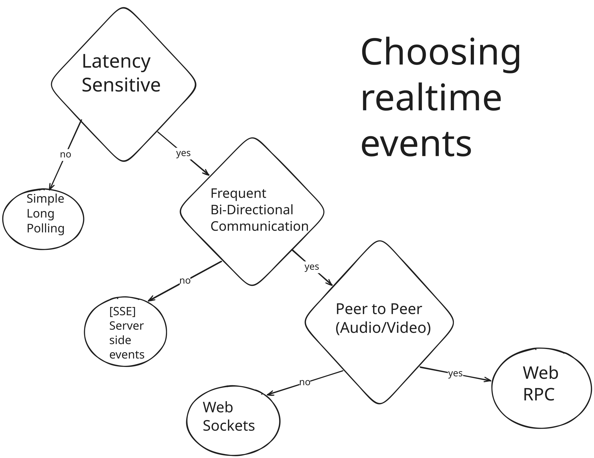
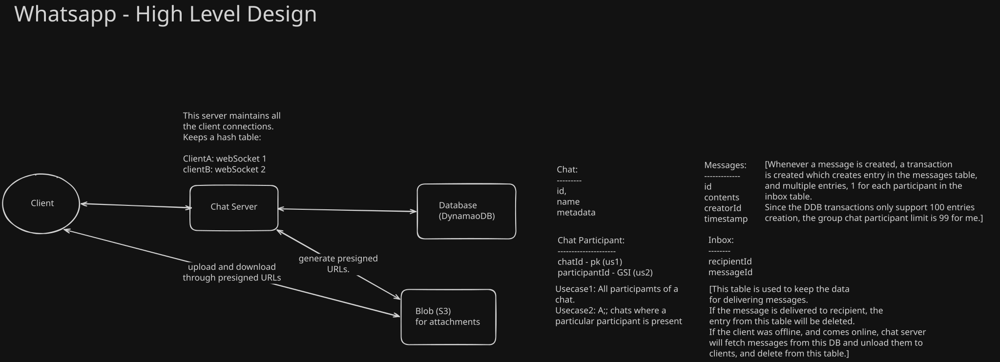
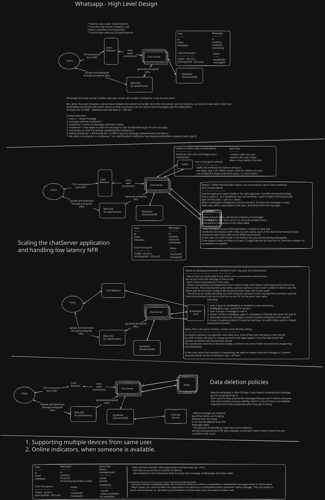

[Reference youtube video](https://www.youtube.com/watch?v=cr6p0n0N-VA)

### Kafka System Design Deep Dive w/ a Ex-Meta Staff Engineer
* https://www.hellointerview.com/learn/system-design/problem-breakdowns/whatsapp
* https://www.hellointerview.com/learn/system-design/patterns/realtime-updates
---------

Question:  
Design whatsapp.

Roadmap for any system design interview:  
1. Requirements - Functional and Non functional.
2. Core Entities
3. API or Interface
4. Data flow
5. High level design
6. Deep dives

-----------------------------------------------

Spend 5 minutes on FRs and NFRs.

**Functional Requirements:**  
* Start group chats.
* Send/receive messages.
* Send/receive media.
* Access messages after I've been offline.

**Non Functional Requirements:**  
* Delivered with low-latency (< 500ms)(give yourself breathing room.)
* Guarantee delivery of messages.
* 100s of millions of users, high throughput (let's not be very specific, will decide during design)
* Messages not stored unnecessarily.
* Fault-tolerant.

**Below the line features:**
* Security issues.
* Scraping.
* People trying to get contact information

-----------------------------------------------

**Core Entities:**  
Talk about actors/personas of the system.

User - all on equal footing.
Chat
Messages
Devices

------------------------------------------------

TODO: Read about the Realtime event infrastructure from HelloInteview.
Multiple options for handling realtime events:
* Long Polling
* SSE
* Web sockets 
* Web RPC

reference: choosing-realtime-events.excalidraw [https://excalidraw.com/]

In actual whatsapp, TLS connection is used. we'll go with web sockets here though.
Same principle applies, we need a persistent connection b/w client and server.

**APIs:** (10 minutes)  

Commands sent:
* createChat
* sendMessage
* createAttachment
* modifyParticipants

Commands received:
* new message notification
* chatUpdate when new chat created.

Be iterative, mention what you're covering now, and then come back to it later.
Basically, all this originates from limited time.

----------------------------------------------------

**High Level Design:**  

reference: hld-without-deep-dive.excalidraw [https://excalidraw.com/]

* Have created a single chat server, that serves all the traffic, obviously not ideal.
* This covers all the functional requirements. 
* The nest step in the deep dive section is going to be about the non-functional requirements. 
* While coming up with this basic design, consistently remind the interviewer that you're taking some shortcuts and will come back to these.

-------------------------------------------------------

**Deep dives:**  

TODO: Read about Apache zookeeper (older, chunkier), or etcd (faster, written in GO, powers kubernetes across the world)

Storage requirements of the system:
1 billion people, 100 messages per day = 100 billion messages per day.
1KB/message = 100 billion KB = 100 trillion bytes = 100 TB per day.

Since most messages and inbox will be deleted immediately, the maximum size we might need to handle 
is ~500 TB.

Couple of deep dive angles:
* multiple chat server and persistent connections my each server to different users.
* data deletion policy.

Other deep dives:
* User maintaining multiple devices.
* online/offline indicators.

reference: hld-with-deep-dive.excalidraw [https://excalidraw.com/]
    

